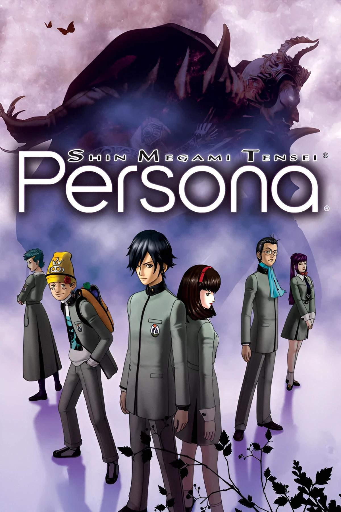
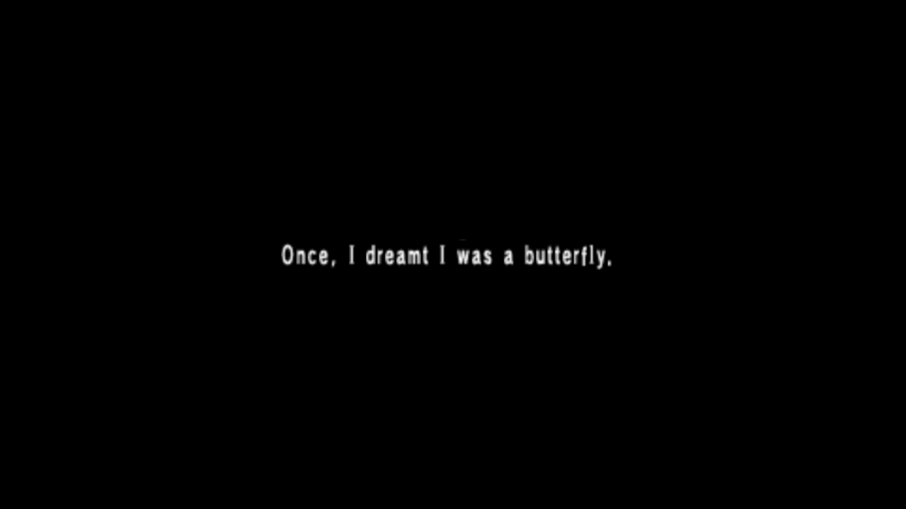
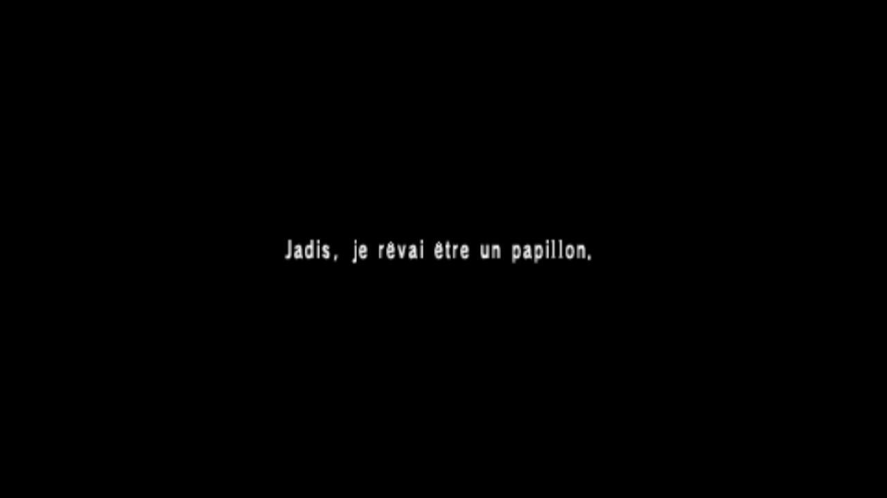
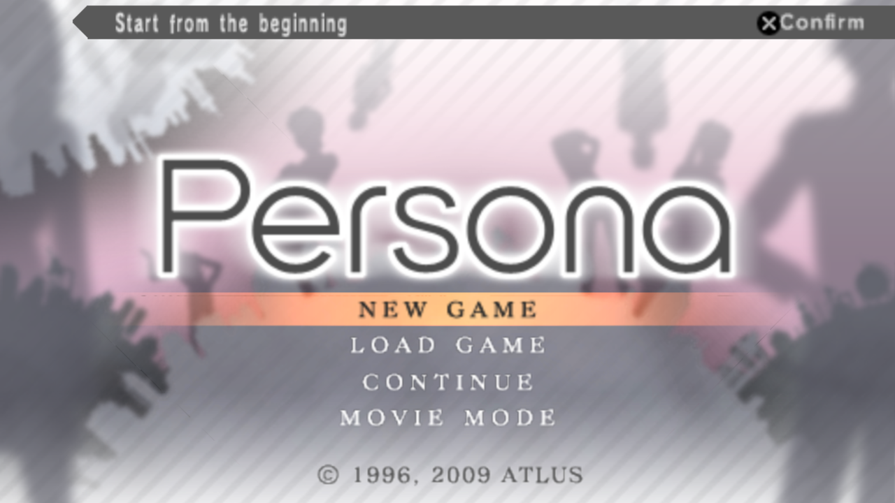
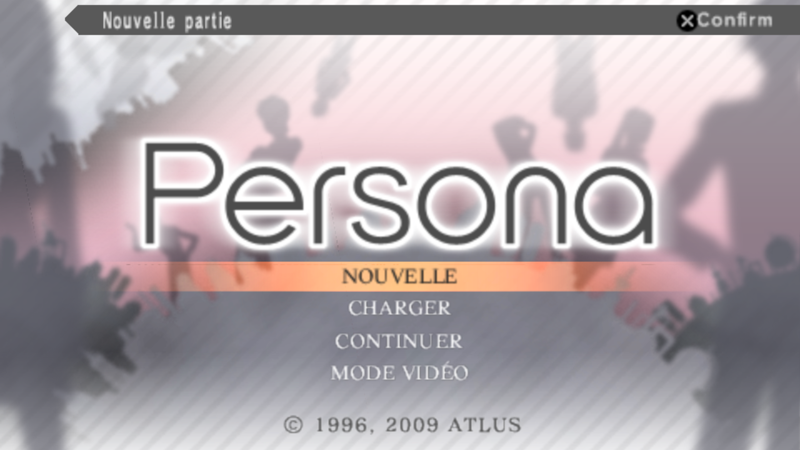
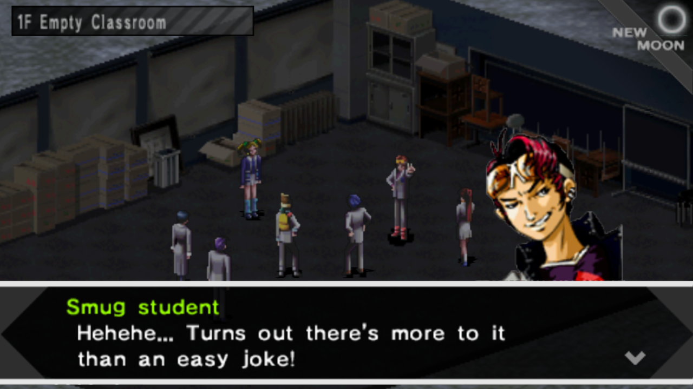
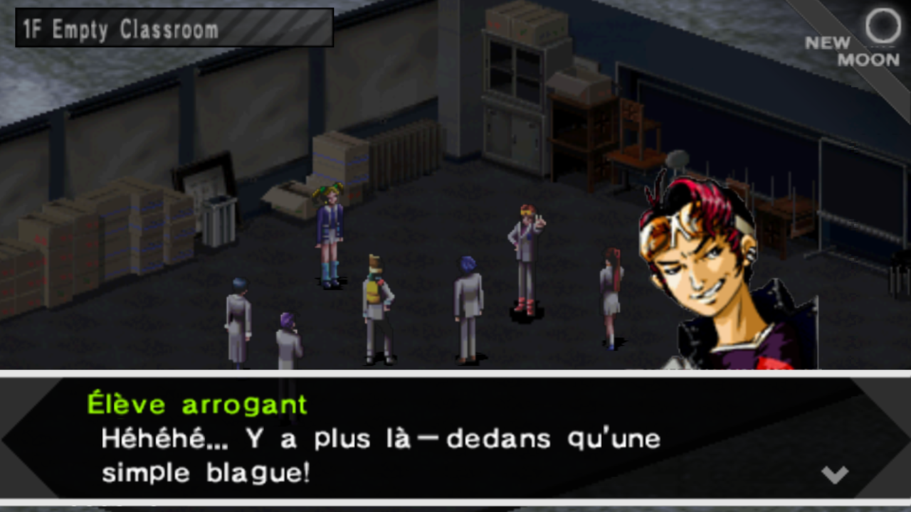
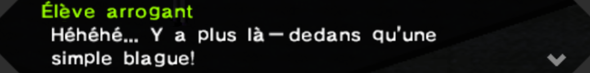

# Persona 1 FR

**Traduction française de *Shin Megami Tensei: Persona*** (PSP, version
américaine `ULUS-10432`). Le jeu n'est jamais sorti en français ; ce projet
vise une version complète, jouable, et écrite en vrai français — accents
compris.


**On cherche des traducteurs.** Rien à installer : tu ouvres un fichier dans
ton navigateur, tu écris, tu proposes. Un robot vérifie la technique à ta
place.

👉 **[Comment aider](CONTRIBUTING.md)** · **[Avancement](SUIVI.md)** · **[FAQ](docs/FAQ.md)**

<br clear="right">

---

## À quoi ça ressemble

| Anglais d'origine | Français |
|---|---|
|  |  |
|  |  |
|  |  |

Les accents ont demandé le plus gros du travail technique : le jeu américain
n'a **aucun glyphe accentué** — les cases correspondantes de sa police sont
vides. Il a fallu les dessiner un par un dans les atlas de textures, puis
régler leurs métriques. Vingt-cinq caractères, validés en jeu.

<p align="center">
  
</p>

---

## Ton premier fichier, en cinq minutes

1. Ouvre [SUIVI.md](SUIVI.md), prends un fichier marqué **libre**.
2. Clique dessus dans [`trad/dialogues/`](trad/dialogues/), puis sur le
   crayon ✏️ en haut à droite.
3. Remplis les champs `fr`. Ne touche à rien d'autre.
4. En bas : **Create a new branch**, puis **Propose changes**.
5. Le robot te répond en une minute et annote précisément ce qui cloche, s'il
   y a lieu. Tu corriges au même endroit.

Tout est détaillé dans **[CONTRIBUTING.md](CONTRIBUTING.md)**. Tu n'as pas
besoin du jeu, ni de savoir coder, ni d'avoir fini le fichier d'un coup.

---

## Ce qui est ouvert

| | |
|---|---|
| **Dialogues** | 8 572 textes, 104 fichiers — **ouvert** |
| Négociations | l'extracteur perd 535 chaînes ; on ne fait pas traduire sur une source trouée |
| Menus, objets, sorts | zones de l'exécutable pas encore cartographiées |

Le jeu répète énormément : 17 685 lignes de dialogue pour 8 572 textes
distincts. Trois répliques de l'Arbre Agastya reviennent près de 570 fois
chacune. Tu ne traduis chaque texte **qu'une fois** — la propagation vers
toutes ses occurrences est automatique.

## La suite

- [x] chaîne technique refaite, du JSON jusqu'à l'ISO
- [x] accents dessinés et validés en jeu
- [x] introduction traduite, images de l'écran-titre traduites
- [x] validation automatique des contributions
- [ ] **les dialogues** — c'est là qu'on a besoin de monde
- [ ] réparer l'extracteur des négociations, puis les ouvrir
- [ ] cartographier les menus, objets et sorts dans l'exécutable
- [ ] première version publique du correctif

Pas de date : c'est un projet de loisir. L'avancement réel est dans
[SUIVI.md](SUIVI.md), recalculé à chaque contribution.

## Comment on teste

Les traductions fusionnées ici sont réinjectées dans le jeu par les
mainteneurs, qui publient un correctif `.xdelta` de temps à autre. Tu n'as pas
besoin du jeu pour contribuer, mais si tu l'as :

1. il faut **posséder une copie légale** du jeu ;
2. le correctif s'applique sur l'ISO américaine avec [xdelta](https://www.romhacking.net/utilities/598/) ;
3. les accents demandent l'option **Remplacement de textures** de PPSSPP — la
   marche à suivre accompagne chaque version.

**Aucune ISO n'est distribuée ici, et il n'en sera jamais distribué.**

## Structure

```text
trad/dialogues/   les fichiers à traduire
docs/             le guide, les règles de style, le dictionnaire
outils/           le validateur, qu'on peut lancer chez soi (Ruby)
SUIVI.md          généré, jamais édité à la main
```

## Remerciements

- **Zenshou** (`@xrize._`) — sa chaîne d'outils et ses réponses sont à
  l'origine de tout ce qui marche ici. Rien de ce projet n'existerait sans lui.
- **GarekMallen** — éditeur PT-BR, table d'accents confirmée par recoupement,
  et une interface française écrite pour nous.
- **chenetulipe et l'équipe [P2-FR-IS-PSP](https://github.com/chenetulipe/P2-FR-IS-PSP)** —
  modèle d'organisation.
- **Atlus / SEGA** — ayants droit du jeu.

## Position juridique

Projet de fans, sans but lucratif, sans aucun lien avec Atlus ou SEGA. Aucune
donnée du jeu n'est redistribuée : uniquement un correctif, qui exige de
posséder le jeu. Le script anglais est publié en clair parce que c'est la seule
façon de traduire à plusieurs — c'est un choix assumé. À la première demande
d'un ayant droit, le dépôt est retiré.

L'illustration de couverture et les captures d'écran appartiennent à
Atlus / SEGA ; elles ne sont reproduites qu'à titre d'identification du jeu.
La traduction française, elle, est publiée sous
[CC BY-NC-SA 4.0](LICENSE). Le texte anglais d'origine appartient à Atlus.
